# Perceptor Robot

[](https://docs.ros.org/en/jazzy/)
[](https://www.raspberrypi.org/)
[](LICENSE)

<table>
<tr>
<td width="600">

</td>
<td>

A comprehensive ROS2 robotics platform for autonomous navigation, SLAM mapping, and sensor fusion using an iRobot Create 2 base with integrated LiDAR sensor. Features include advanced autonomous navigation with keepout zones, variable speed limits, visual waypoint navigation, real-time collision monitoring, and multi-sensor fusion using Extended Kalman Filter (EKF). Designed for educational robotics, research applications, and maker projects with full simulation support and real hardware deployment capabilities.

**Core Capabilities:**
- 🗺️ **Real-time SLAM** — Pose graph-based mapping with loop closure detection via SLAM Toolbox
- 🧭 **Autonomous Navigation** — Full Nav2 stack with MPPI controller, path planning, and obstacle avoidance
- 🔄 **Multi-Sensor Fusion** — EKF combining wheel odometry (Create 2) + IMU (MPU6050) for drift-reduced localization
- 🚧 **Advanced Nav Features** — Keepout zones, variable speed limits, waypoint following, collision monitoring
- 📷 **Visual Servoing** — Real-time blob detection and tracking using OpenCV SimpleBlobDetector
- 🎮 **Teleoperation** — Nintendo Pro Controller via Bluetooth with priority-based command arbitration

**Tech Stack:** `ROS 2 Jazzy` • `Nav2` • `SLAM Toolbox` • `AMCL` • `robot_localization` • `twist_mux` • `OpenCV` • `create_robot`

</td>
</tr>
</table>

---

## 📊 Demonstration Videos

| Feature | Video |
|---------|-------|
| **Basic Teleoperation** | [](https://youtube.com/shorts/rfim3H5mtzY) |
| **SLAM Mapping** | [](https://www.youtube.com/watch?v=ATwA-HLwSGA) |
| **Autonomous Navigation** | [](https://www.youtube.com/watch?v=_yviKw15OY4) |
| **Waypoint Navigation** | [](https://www.youtube.com/watch?v=LgVZ5oakM-A) |
| **Keepout Zones** | [](https://www.youtube.com/watch?v=esaRK12SdbA) |
| **Speed Limits** | [](https://www.youtube.com/watch?v=KDUamMYnVzM) |

---

## 🚀 Quick Start

```bash
# Clone and build workspace
cd ~/Roomba/slam_dev_ws
colcon build --packages-select perceptor
source install/setup.bash

# Launch robot with teleoperation
ros2 launch perceptor launch_robot.launch.py

# Launch sensors separately (modular approach)
ros2 launch perceptor sensors.launch.py

# Visualization (on host computer with display)
ros2 run rviz2 rviz2 -d src/perceptor/config/main.rviz
```

## 📋 Table of Contents

- **[1. System Architecture](#1-system-architecture)**
  - [Hardware Architecture](#hardware-architecture)
    - [Component Details](#component-details)
    - [Hardware Connections](#hardware-connections)
    - [create_driver Interface](#create_driver-interface)
    - [Mechanical Design & CAD Models](#mechanical-design--cad-models)
  - [Software Architecture](#software-architecture)
    - [ROS2 Package Structure](#ros2-package-structure)
    - [Node Topology](#node-topology)
    - [Launch File Architecture](#launch-file-architecture)

- **[2. Robotics Pipeline](#2-robotics-pipeline)**
  - **Sense**
    - [LiDAR Integration](#lidar-integration)
    - [IMU Integration](#imu-integration)
    - [Camera Integration](#camera-integration)
    - [Joystick Control](#joystick-control)
  - **Plan**
    - [Path Planning Overview](#path-planning-overview)
  - **Act**
    - [Waypoint Following](#waypoint-following)
    - [Collision Monitoring](#collision-monitoring)
    - [Visual Servoing](#visual-servoing)

- **[3. Sensor Fusion (EKF)](#3-sensor-fusion-ekf)**
  - [Hardware Components](#hardware-components)
  - [Software Components](#software-components)
  - [Package Dependencies](#package-dependencies)
  - [EKF Configuration](#ekf-configuration)

- **[4. SLAM Mapping](#4-slam-mapping)**
  - [Software Components](#software-components-1)
  - [Demonstration Videos](#demonstration-videos)
  - [Package Dependencies](#package-dependencies-1)
  - [Launch File Usage](#launch-file-usage)
  - [Algorithm Deep Dive](#algorithm-deep-dive)
    - [Scan Matching](#scan-matching)
    - [Graph-Based SLAM & Pose Graph Optimization](#graph-based-slam--pose-graph-optimization)
    - [Loop Closure Detection](#loop-closure-detection)
    - [Solver Modes](#solver-modes)
  - [Alternative SLAM Methods](#alternative-slam-methods)

- **[5. Localization (AMCL)](#5-localization-amcl)**
  - [Overview](#overview)
  - [Software Components](#software-components-2)
  - [Demonstration Videos](#demonstration-videos-1)
  - [Package Dependencies](#package-dependencies-2)
  - [Launch File Usage](#launch-file-usage-1)
  - [AMCL Configuration](#amcl-configuration)

- **[6. Nav2 Navigation Stack](#6-nav2-navigation-stack)**
  - [Architecture Overview](#architecture-overview)
    - [Server-Plugin System](#server-plugin-system)
    - [Behavior Tree Navigator](#behavior-tree-navigator)
  - [Global Planning](#global-planning)
    - [NavFn Planner](#navfn-planner)
    - [SmacPlanner2D](#smacplanner2d)
    - [Planner Comparison](#planner-comparison)
  - [Local Control](#local-control)
    - [MPPI Controller](#mppi-controller)
    - [Regulated Pure Pursuit (RPP)](#regulated-pure-pursuit-rpp)
    - [Controller Comparison](#controller-comparison)
    - [Goal and Progress Checkers](#goal-and-progress-checkers)
  - [Costmaps](#costmaps)
    - [Global Costmap](#global-costmap)
    - [Local Costmap](#local-costmap)
  - [Costmap Filters](#costmap-filters)
    - [Keepout Zones](#keepout-zones)
    - [Speed Limit Zones](#speed-limit-zones)
  - [Recovery Behaviors](#recovery-behaviors)
  - [Behavior Tree Flow](#behavior-tree-flow)
    - [Complete Flow Example](#complete-flow-example)
    - [Runtime Algorithm Selection](#runtime-algorithm-selection)

- **[7. Getting Started](#7-getting-started)**
  - [Prerequisites](#prerequisites)
  - [Complete Installation Guide](#complete-installation-guide)
  - [Quick Launch Guide](#quick-launch-guide)

- **[8. Troubleshooting](#8-troubleshooting)**
  - [Common Hardware Issues](#common-hardware-issues)
  - [Software Debugging](#software-debugging)
  - [Integration Challenges](#integration-challenges)

- **Additional Resources**
  - [Acknowledgments](#acknowledgments)
  - [Contributing](#contributing)
  - [License](#license)

---

## 1. System Architecture

The Perceptor robot follows a modular architecture designed for flexibility, real-world deployment, and educational clarity. The system separates hardware interfaces, perception, planning, and control into distinct layers.

### Hardware Architecture

The hardware stack integrates a mobile robot base with perception sensors and a central compute platform:

```mermaid
flowchart TB
    subgraph POWER["⚡ Power System"]
        BATT["🔋 Create 2 Battery<br/>14.4V 3000mAh"]
        VREG["USB Power<br/>5V to Pi 5"]
    end

    subgraph COMPUTE["🧠 Compute Platform"]
        PI5["Raspberry Pi 5<br/>8GB RAM<br/>ROS 2 Jazzy<br/>Headless Mode"]
    end

    subgraph SENSORS["📡 Sensor Suite"]
        LIDAR["RPLiDAR A1/A2<br/>360° @ 10Hz<br/>0.15-12m range"]
        IMU["MPU6050 IMU<br/>6-axis @ 100Hz<br/>I2C Interface"]
        CAM["USB Camera<br/>640×480 RGB"]
    end

    subgraph CONTROL["🎮 Control Interface"]
        JOY["Nintendo Pro Controller<br/>Bluetooth"]
    end

    subgraph ROBOT["🤖 Mobile Platform"]
        CREATE["iRobot Create 2<br/>Differential Drive<br/>Wheel Encoders"]
    end

    BATT --> CREATE
    BATT -->|"USB"| VREG --> PI5
    LIDAR -->|"USB Serial"| PI5
    IMU -->|"I2C"| PI5
    CAM -->|"USB"| PI5
    JOY -->|"Bluetooth"| PI5
    PI5 -->|"USB Serial"| CREATE
```



#### Component Details

| Component | Specification | Interface | Purpose |
|-----------|--------------|-----------|---------|
| **iRobot Create 2** | Differential drive, 348.5mm diameter | USB Serial `/dev/ttyUSB*` | Mobile base with wheel encoders, cliff sensors |
| **Raspberry Pi 5** | 8GB RAM, ARM Cortex-A76 Quad-core | Central hub | ROS 2 Jazzy compute platform (headless) |
| **RPLiDAR A1/A2** | 360°, 10Hz, 0.15-12m range, 1° resolution | USB Serial `/dev/ttyUSB0` | 2D laser scanning for SLAM and navigation |
| **MPU6050 IMU** | 6-axis (3-axis gyro + 3-axis accel), 100Hz | I2C @ 0x68 | Angular velocity and linear acceleration for EKF |
| **USB Camera** | 640×480 RGB, 30fps | USB | Visual servoing and ball tracking |
| **Nintendo Pro Controller** | Bluetooth gamepad, dual analog sticks | Bluetooth | Teleoperation with deadman switch |

#### Hardware Connections

| Connection | Source | Destination | Protocol | Notes |
|------------|--------|-------------|----------|-------|
| Robot Power | Create 2 Battery (14.4V) | Create 2 + USB 5V | Power | Powers robot base and Pi 5 via USB |
| Robot Control | Pi 5 | Create 2 | USB Serial 115200 baud | Velocity commands, odometry, sensor data |
| LiDAR Data | RPLiDAR | Pi 5 | USB Serial | Scan data at 10Hz, 360 points/scan |
| IMU Data | MPU6050 | Pi 5 GPIO | I2C (SDA/SCL) | 6-axis motion data at 100Hz |
| Camera Feed | USB Camera | Pi 5 | USB | RGB frames at 30fps |
| Controller | Pro Controller | Pi 5 | Bluetooth | Button/axis events |

#### iRobot Create 2 Platform

| Specification | Value | Notes |
|---------------|-------|-------|
| **Drive Type** | Differential drive | 2 independently driven wheels |
| **Base Diameter** | 348.5 mm | Circular footprint |
| **Wheel Separation** | 235 mm | Distance between wheel centers |
| **Wheel Radius** | 36 mm | Drive wheel radius |
| **Max Linear Velocity** | 0.5 m/s | Forward/backward |
| **Max Angular Velocity** | 4.25 rad/s | Rotation in place |
| **Battery** | 14.4V, ~3000mAh | NiMH or Li-ion |
| **Built-in Sensors** | Wheel encoders, cliff sensors, bumpers, light bumpers, IR receivers | Hardware safety features |

#### create_driver Interface

The `create_driver` package provides the ROS 2 interface to the iRobot Create 2:

| Topic | Type | Direction | Description |
|-------|------|-----------|-------------|
| `/cmd_vel` | `geometry_msgs/Twist` | Subscribe | Velocity commands (linear.x, angular.z) |
| `/odom` | `nav_msgs/Odometry` | Publish | Wheel odometry (pose + twist) |
| `/joint_states` | `sensor_msgs/JointState` | Publish | Wheel positions and velocities |
| `/battery/capacity` | `std_msgs/Float32` | Publish | Battery charge percentage |
| `/bumper` | `std_msgs/Bool` | Publish | Front bumper contact state |

**Key Services:**
- `/dock` - Navigate to charging dock
- `/undock` - Leave charging dock
- `/reset` - Reset robot state

#### Mechanical Design & CAD Models

The Perceptor robot integrates commercial off-the-shelf components with custom 3D-printed mounts designed in Fusion 360. All sensor mounts are optimized for rigidity and thermal management while maintaining modularity for component upgrades.

**Complete Robot Assembly:**


*Fully assembled Perceptor robot showing iRobot Create 2 base, Raspberry Pi 5 compute platform, RPLiDAR, IMU, and USB camera integration*

**Component CAD Models:**

| Component | CAD Render |
|-----------|------------|
| **iRobot Create 2 Base** |  |
| **Raspberry Pi 5 with Heat Sink** |  |

*Mobile platform base and compute unit with passive cooling for headless operation*

**Sensor Mount Configurations:**

| Configuration | CAD Render |
|---------------|------------|
| **LiDAR + Camera** |  |
| **IMU + Camera** |  |
| **LiDAR + IMU + Camera** |  |

*Modular sensor mounting configurations showing various integration options for perception stack*

### Software Architecture

The software stack follows a layered ROS 2 architecture with clear separation between hardware drivers, perception, planning, and control:

```mermaid
flowchart TB
    subgraph DRIVER["🔧 Hardware Drivers"]
        CD["create_driver<br/>/odom, /cmd_vel"]
        RP["rplidar_ros<br/>/scan"]
        JOY["joy_node<br/>/joy"]
        IMU_DRV["mpu6050_driver<br/>/imu/mpu6050"]
        CAM["usb_cam<br/>/image_raw"]
    end

    subgraph CONTROL["🎮 Control Layer"]
        TELEOP["teleop_twist_joy<br/>/cmd_vel_joy"]
        TRACKER["ball_tracker<br/>/cmd_vel_tracker"]
        TMUX["twist_mux<br/>/cmd_vel"]
    end

    subgraph PERCEPTION["👁️ Perception Layer"]
        EKF["robot_localization (EKF)<br/>/odometry/filtered"]
        SLAM["slam_toolbox<br/>/map"]
        AMCL["nav2_amcl<br/>/amcl_pose"]
    end

    subgraph PLANNING["🗺️ Planning Layer"]
        PLANNER["nav2_planner<br/>/plan"]
        CONTROLLER["nav2_controller (MPPI)<br/>/cmd_vel_nav"]
        BT["bt_navigator<br/>Behavior Trees"]
    end

    CD --> EKF
    IMU_DRV --> EKF
    RP --> SLAM
    RP --> AMCL
    EKF --> SLAM
    EKF --> AMCL
    AMCL --> PLANNER
    PLANNER --> CONTROLLER
    CONTROLLER --> TMUX
    TELEOP --> TMUX
    TRACKER --> TMUX
    TMUX --> CD
    JOY --> TELEOP
    CAM --> TRACKER
```



#### ROS2 Package Structure

```
perceptor/
├── config/                    # Configuration files
│   ├── nav2_params.yaml       # Nav2 stack parameters (455 lines)
│   ├── ekf_config.yaml        # EKF sensor fusion configuration
│   ├── mapper_params_online_async.yaml  # SLAM Toolbox parameters
│   ├── twist_mux.yaml         # Command priority configuration
│   ├── pro_controller.yaml    # Joystick button mapping
│   ├── ball_tracker_params_robot.yaml   # Visual servoing parameters
│   ├── keepout_filter_info.yaml         # Keepout zone configuration
│   ├── speed_filter_info.yaml           # Speed limit zone configuration
│   └── *.rviz                 # RViz visualization configurations
├── launch/                    # Launch files
│   ├── launch_robot.launch.py # Main robot bringup (Pi 5)
│   ├── localization_launch.py # AMCL localization
│   ├── navigation_launch.py   # Nav2 navigation stack
│   ├── sensor_fusion.launch.py # EKF fusion launch
│   ├── keepout_extension.launch.py      # Keepout zone filter
│   ├── speed_extension.launch.py        # Speed limit filter
│   └── *.launch.py            # Modular component launches
├── maps/                      # Pre-built environment maps
│   ├── home.yaml/.pgm         # Primary navigation map (0.05m resolution)
│   ├── keepout_mask.yaml/.pgm # No-go zone definitions
│   └── speed_mask.yaml/.pgm   # Variable speed zone definitions
├── scripts/                   # Utility scripts
│   ├── create_keepout_mask.py # Interactive keepout zone creation
│   ├── create_speed_mask.py   # Speed zone mask generation
│   └── waypoint_manager.py    # Waypoint sequence management
├── description/               # Robot URDF/Xacro files
│   ├── robot.urdf.xacro       # Main robot description
│   ├── lidar.xacro            # LiDAR sensor description
│   └── imu.xacro              # IMU sensor description
└── docs/media/                # Documentation assets
```

#### Launch File Architecture

The system uses a **modular multi-terminal approach** for maximum flexibility:

| Terminal | Launch File | Components | Purpose |
|----------|-------------|------------|---------|
| **T1** | `launch_robot.launch.py` | Robot base, LiDAR, IMU, joystick, EKF | Core robot hardware and sensors |
| **T2** | `localization_launch.py` | Map server, AMCL | Load map and localize robot |
| **T3** | `navigation_launch.py` | Nav2 planner, controller, BT | Path planning and execution |
| **T4** | `keepout_extension.launch.py` | Keepout filter | (Optional) No-go zones |
| **T4** | `speed_extension.launch.py` | Speed filter | (Optional) Speed limit zones |

**Benefits of Modular Architecture:**
- Independent component start/stop without affecting others
- Easy debugging by isolating issues to specific terminals
- Flexible configuration for different operational modes
- Standard Nav2 pattern following best practices

#### Node Topology


**TF Tree - Basic Teleoperation:**

*Coordinate frame hierarchy for basic teleoperation: odom→base_link→laser/imu_link. The odom frame provides local odometry reference while sensor frames define LiDAR and IMU mounting.*

**TF Tree - Navigation Stack:**

*Full navigation TF tree: map→odom→base_link→sensor frames. AMCL provides the map→odom transform for global localization, enabling autonomous navigation in the world coordinate frame.*

**Command Priority (twist_mux):**

| Source | Topic | Priority | Timeout | Use Case |
|--------|-------|----------|---------|----------|
| Joystick | `/cmd_vel_joy` | 100 | 0.5s | Manual override (highest) |
| Ball Tracker | `/cmd_vel_tracker` | 20 | 0.5s | Visual servoing |
| Navigation | `/cmd_vel_nav` | 10 | 0.5s | Autonomous navigation |

---

## 2. Robotics Pipeline

This section organizes capabilities following the standard robotics pipeline: **Sense → Plan → Act**. The perception algorithms (EKF, SLAM, AMCL) are covered in dedicated chapters 3-5.

### Sense (Sensors & Inputs)

#### LiDAR Integration

| Specification | Value |
|---------------|-------|
| **Model** | RPLiDAR A1/A2 (360° laser scanner) |
| **Range** | 0.15m to 12.0m |
| **Field of View** | 360° |
| **Angular Resolution** | 1° (360 samples/rotation) |
| **Scan Rate** | 10 Hz |
| **Interface** | USB Serial (`/dev/ttyUSB0`) |
| **ROS2 Package** | `rplidar_ros` |
| **Output Topic** | `/scan` (`sensor_msgs/LaserScan`) |
| **Physical Mounting** | Geometric center, 200mm above base_link |
| **Coordinate Frame** | `laser` frame with 180° Z-axis rotation |

**Data Flow:**


**Launch Commands:**
```bash
# Launch LiDAR sensor separately
ros2 launch perceptor rplidar.launch.py

# Robot operation with LiDAR enabled
ros2 launch perceptor launch_robot.launch.py enable_camera:=false

# Verify scan data
ros2 topic echo /scan --once
ros2 topic hz /scan  # Should show ~10Hz
```

**Package Dependencies:**
```bash
sudo apt install ros-jazzy-rplidar-ros ros-jazzy-tf2-ros ros-jazzy-sensor-msgs
```

#### IMU Integration

| Specification | Value |
|---------------|-------|
| **Model** | MPU6050 |
| **Axes** | 6-axis (3-axis gyro + 3-axis accelerometer) |
| **Sampling Rate** | 100 Hz |
| **Interface** | I2C @ address 0x68 |
| **ROS2 Package** | Custom `mpu6050_driver` |
| **Output Topic** | `/imu/mpu6050` (`sensor_msgs/Imu`) |
| **Mounting** | Center of robot, 10cm above base_link |
| **Coordinate Frame** | `imu_link` (static transform from base_link) |

**Data Flow:**


```mermaid
flowchart LR
    subgraph HW["🔩 Hardware"]
        IMU["MPU6050<br/>6-axis IMU"]
    end
    subgraph INTERFACE["📶 Interface"]
        I2C["I2C Bus<br/>@ 0x68"]
    end
    subgraph DRIVER["🔧 Driver"]
        DRV["mpu6050_driver"]
    end
    subgraph TOPIC["📡 Topic"]
        DATA["/imu/mpu6050<br/>sensor_msgs/Imu"]
    end
    subgraph FUSION["🧮 Fusion"]
        EKF["robot_localization<br/>EKF"]
    end
    IMU --> I2C --> DRV --> DATA --> EKF
```

**I2C Setup:**
```bash
# Enable I2C interface on Raspberry Pi
sudo raspi-config  # Interface Options → I2C → Enable

# Install I2C tools
sudo apt install i2c-tools python3-smbus

# Verify IMU detection
i2cdetect -y 1  # Should show device at 0x68
```

#### Camera Integration

| Specification | Value |
|---------------|-------|
| **Model** | USB Camera (generic V4L2) |
| **Resolution** | 640×480 RGB |
| **Frame Rate** | 30 fps |
| **Interface** | USB |
| **ROS2 Package** | `usb_cam` |
| **Output Topic** | `/image_raw` (`sensor_msgs/Image`) |
| **Use Case** | Visual servoing, ball tracking |

**Launch Commands:**
```bash
# Launch camera sensor
ros2 launch perceptor camera.launch.py

# Robot operation with camera enabled
ros2 launch perceptor launch_robot.launch.py enable_camera:=true enable_lidar:=false
```

#### Joystick Control

| Specification | Value |
|---------------|-------|
| **Model** | Nintendo Pro Controller |
| **Interface** | Bluetooth |
| **ROS2 Package** | `joy` + `teleop_twist_joy` |
| **Deadman Switch** | Y Button (button 3) |
| **Linear Axis** | Left stick vertical (axis 1) |
| **Angular Axis** | Left stick horizontal (axis 0) |
| **Speed Modes** | Slow: 0.2 m/s linear, 1.2 rad/s angular |
| | Fast: 0.4 m/s linear, 2.4 rad/s angular |

**Control Architecture:**

```mermaid
flowchart LR
    subgraph INPUT["🎮 Input"]
        JOY["Nintendo Pro<br/>Controller"]
    end
    subgraph NODES["🔧 ROS2 Nodes"]
        JOYN["joy_node<br/>/joy"]
        TELEOP["teleop_twist_joy<br/>/cmd_vel_joy"]
        MUX["twist_mux<br/>/cmd_vel"]
    end
    subgraph DRIVER["🤖 Robot Driver"]
        CD["create_driver"]
    end
    subgraph ROBOT["⚙️ Actuators"]
        BASE["Create 2<br/>Motors"]
    end
    JOY -->|"Bluetooth"| JOYN --> TELEOP --> MUX --> CD --> BASE
```


**Bluetooth Pairing:**
```bash
sudo bluetoothctl
scan on
# Hold Share + Home buttons on controller
pair XX:XX:XX:XX:XX:XX
trust XX:XX:XX:XX:XX:XX
connect XX:XX:XX:XX:XX:XX
exit

# Verify controller detection
ls /dev/input/js*  # Should show js0
ros2 topic echo /joy --once
```

**Demonstration Video:**
[](https://youtube.com/shorts/rfim3H5mtzY)
*Basic Teleoperation Demo - Nintendo Pro Controller with deadman switch and joystick control*

**ROS Graph - Teleoperation:**

*ROS2 node graph showing joystick driver, twist_mux command arbitration, and Create 2 velocity output*

### Plan (Path Planning)

#### Path Planning Overview

Path planning is handled by the Nav2 Navigation Stack, which provides:

| Component | Algorithm | Purpose |
|-----------|-----------|---------|
| **Global Planner** | NavFn (Dijkstra) | Compute optimal path from start to goal |
| **Local Controller** | MPPI | Follow path while avoiding dynamic obstacles |
| **Costmaps** | Layered costmaps | Represent obstacles and traversability |
| **Costmap Filters** | Keepout/Speed zones | Enforce navigation constraints |

> 📖 **See [Section 6: Nav2 Navigation Stack](#6-nav2-navigation-stack)** for detailed documentation on:
> - Global and local planning algorithms
> - Costmap configuration and layers
> - Keepout zones and speed limit zones
> - Behavior tree orchestration
> - Recovery behaviors

### Act (Execution)

Execution components handle robot motion that doesn't use the full Nav2 stack. For autonomous navigation, see [Section 6: Nav2 Navigation Stack](#6-nav2-navigation-stack).

#### Waypoint Following

| Parameter | Value |
|-----------|-------|
| **Plugin** | `nav2_waypoint_follower::WaitAtWaypoint` |
| **Loop Rate** | 20 Hz |
| **Pause Duration** | 2 seconds at each waypoint |
| **Failure Handling** | Continue to next waypoint |

**Interface:** Use RViz "Waypoint Mode" for visual waypoint setting.

**Demonstration Video:**
[](https://www.youtube.com/watch?v=LgVZ5oakM-A)
*Waypoint Navigation Demo - Robot follows a sequence of waypoints set via RViz interface*

#### Collision Monitoring

Real-time safety monitoring with configurable safety zones:

| Zone Type | Action | Description |
|-----------|--------|-------------|
| `PolygonStop` | Emergency stop | Immediate halt when obstacles detected |
| `PolygonSlow` | Speed reduction | Reduce to 30% speed |
| `PolygonApproach` | Warning | Continue with caution |

#### Visual Servoing

Ball tracking and following using OpenCV SimpleBlobDetector:

| Parameter | Value |
|-----------|-------|
| **Package** | `ball_tracker` |
| **Detection** | SimpleBlobDetector (color-based) |
| **Control** | Proportional control to center blob |
| **Output** | `/cmd_vel_tracker` (priority 20) |

---

## 3. Sensor Fusion (EKF)

### Hardware Components

**IMU Sensor:**
- **Model**: MPU6050 (6-axis accelerometer + gyroscope)
- **Interface**: I2C connection to Raspberry Pi 5
- **Sampling Rate**: 100Hz for high-frequency motion data
- **Mounting**: Rigidly attached to robot base for accurate measurements

**Sensor Integration:**
- **Wheel Odometry**: Create 2 built-in encoders (primary)
- **IMU Data**: Angular velocity and linear acceleration (secondary)
- **Fusion Algorithm**: Extended Kalman Filter (EKF) for optimal state estimation

### Software Components

**Sensor Fusion Stack:**
- **Package**: `robot_localization` (industry-standard EKF implementation)
- **Filter Type**: Extended Kalman Filter with 15-state model
- **Input Sources**: Wheel odometry (/odom) + IMU data (/imu/data)
- **Output**: Fused odometry (/odometry/filtered) with improved accuracy

**Data Flow:**


```mermaid
flowchart LR
    subgraph SENSORS["📡 Sensor Sources"]
        WHEEL["Wheel Encoders<br/>/odom"]
        IMU["IMU Sensor<br/>/imu/data"]
    end
    subgraph FUSION["🧮 Fusion"]
        EKF["robot_localization<br/>EKF"]
    end
    subgraph OUTPUT["📤 Output"]
        FUSED["/odometry/filtered"]
    end
    subgraph CONSUMERS["🎯 Consumers"]
        SLAM["slam_toolbox"]
        NAV["Nav2 Stack"]
    end
    WHEEL --> EKF
    IMU --> EKF
    EKF --> FUSED
    FUSED --> SLAM
    FUSED --> NAV
```

### Multimedia Placeholders
- 📊 **[Sensor fusion accuracy comparison]** - Before/after EKF performance metrics
- 📈 **[EKF state estimation visualization]** - Real-time filter performance plots

### Package Dependencies

**Build Requirements:**
```bash
# Robot localization package
sudo apt install ros-jazzy-robot-localization

# IMU driver and messages
sudo apt install ros-jazzy-imu-tools ros-jazzy-sensor-msgs-py

# I2C tools for hardware setup
sudo apt install i2c-tools python3-smbus
```

**Hardware Configuration:**
```bash
# Enable I2C on Raspberry Pi
sudo raspi-config
# Interface Options → I2C → Enable

# Check I2C device detection
sudo i2cdetect -y 1
# Should show MPU6050 at address 0x68
```

### EKF Configuration

**Launch File Setup:**
```bash
# Start sensor fusion
ros2 launch robot_localization ekf.launch.py

# Integrated launch with robot
ros2 launch perceptor launch_robot.launch.py enable_imu:=true
```

**EKF Parameters (ekf_config.yaml):**
```yaml
frequency: 30  # Filter update rate (Hz)
sensor_timeout: 0.1  # Maximum sensor delay (s)

# Odometry configuration
odom0: /odom
odom0_config: [true,  true,  false,  # x, y, z
               false, false, true,   # roll, pitch, yaw
               true,  true,  false,  # vx, vy, vz
               false, false, true,   # vroll, vpitch, vyaw
               false, false, false]  # ax, ay, az

# IMU configuration
imu0: /imu/data
imu0_config: [false, false, false,  # x, y, z
              false, false, true,   # roll, pitch, yaw
              false, false, false,  # vx, vy, vz
              false, false, true,   # vroll, vpitch, vyaw
              true,  true,  false]  # ax, ay, az
```

**Benefits of Sensor Fusion:**
- **Improved Accuracy**: Reduced odometry drift over time
- **Better Orientation**: More stable yaw estimation
- **Faster Response**: Higher update rate than wheel encoders alone
- **Robustness**: Continued operation if one sensor fails

---

## 4. SLAM Mapping

### Software Components

**SLAM Algorithm:**
- **Package**: `slam_toolbox` (pose graph-based SLAM)
- **Algorithm**: Karto SLAM with loop closure detection
- **Map Representation**: Occupancy grid (nav_msgs/OccupancyGrid)
- **Localization**: Particle filter-based pose estimation

**Data Processing Pipeline:**

```mermaid
flowchart LR
    subgraph INPUTS["📡 Inputs"]
        LIDAR["/scan<br/>LaserScan"]
        ODOM["/odom<br/>Odometry"]
    end
    subgraph SLAM["🗺️ SLAM"]
        ST["slam_toolbox<br/>Karto SLAM"]
    end
    subgraph OUTPUTS["📤 Outputs"]
        MAP["/map<br/>OccupancyGrid"]
        TF["TF: map → odom"]
    end
    LIDAR --> ST
    ODOM --> ST
    ST --> MAP
    ST --> TF
```


**Key Features:**
- Real-time mapping during robot operation
- Loop closure detection for map consistency
- Pose graph optimization for drift correction
- Map serialization for persistent storage

### Demonstration Videos
[](https://www.youtube.com/watch?v=ATwA-HLwSGA)
*Real-time SLAM Mapping Demo - Watch the robot build a complete house map in real-time*

### Package Dependencies

**Build Requirements:**
```bash
# SLAM Toolbox
sudo apt install ros-jazzy-slam-toolbox

# Navigation messages and TF
sudo apt install ros-jazzy-nav-msgs ros-jazzy-tf2-geometry-msgs
```

**Configuration Files:**
```bash
# SLAM configuration
src/perceptor/config/slam_config.yaml

# Map saving location
maps/generated_map.yaml
maps/generated_map.pgm
```

### Launch File Usage

**SLAM Launch Commands:**
```bash
# Start SLAM mapping with custom configuration
ros2 launch slam_toolbox online_async_launch.py slam_params_file:=/home/pi/Roomba/slam_dev_ws/src/perceptor/config/mapper_params_online_async.yaml
```

**Map Generation Process:**
1. **Start Robot**: Launch robot base and LiDAR sensor
2. **Initialize SLAM**: Start slam_toolbox node with custom configuration
3. **Load SLAM Toolbox Panel**: Open the SLAM Toolbox panel in RViz
4. **Explore Environment**: Drive robot around to build the map
5. **Monitor Progress**: Watch map building in RViz interface
6. **Save Map**: Use the SLAM Toolbox panel to save the generated map

**Important Note:** The map files will be saved on the machine where the SLAM command was executed. Use the SLAM Toolbox panel in RViz for the most reliable map saving process.

**SLAM Parameters:**
- `map_frame`: Map coordinate frame (default: map)
- `odom_frame`: Odometry frame (default: odom)
- `base_frame`: Robot base frame (default: base_link)
- `scan_topic`: LiDAR data topic (default: /scan)
- `resolution`: Map resolution in meters/pixel (default: 0.05)

### Algorithm Deep Dive

> 📖 **Documentation:** [slam_toolbox README](https://github.com/SteveMacenski/slam_toolbox)

slam_toolbox uses **Karto SLAM**, a graph-based SLAM algorithm originally developed by SRI International. Understanding its internals helps with parameter tuning and debugging.

#### Scan Matching

Scan matching aligns new laser scans with existing map data to estimate robot motion.

| Component | Description |
|-----------|-------------|
| **Correlative Scan Matcher** | Brute-force search over translation/rotation space |
| **Response Function** | Measures scan-to-map alignment quality |
| **Multi-Resolution** | Coarse-to-fine search for efficiency |
| **Outlier Rejection** | Filters spurious scan points |

**Process:**
1. Robot receives new laser scan
2. Correlative matcher searches for best alignment with local map
3. Match quality (response) determines confidence
4. High-confidence matches create new pose graph nodes

**Key Parameters:**
```yaml
# Scan matching parameters
minimum_travel_distance: 0.5      # Min distance before adding new node
minimum_travel_heading: 0.5       # Min rotation before adding new node
scan_buffer_size: 10              # Scans to buffer for matching
link_match_minimum_response_fine: 0.1  # Min response for valid match
```

#### Graph-Based SLAM & Pose Graph Optimization

slam_toolbox maintains a **pose graph** where:
- **Nodes** = Robot poses at discrete time steps
- **Edges** = Constraints from odometry and scan matching


**Sparse Pose Adjustment (SPA):**
- Uses Ceres Solver for nonlinear least squares optimization
- Minimizes error between predicted and observed constraints
- Runs incrementally as new nodes are added
- Full optimization triggered by loop closures

#### Loop Closure Detection

Loop closure detects when the robot returns to a previously visited location, correcting accumulated drift.

| Stage | Method |
|-------|--------|
| **Candidate Selection** | Spatial proximity search in pose graph |
| **Scan Matching** | Correlative matcher validates candidates |
| **Constraint Addition** | Valid matches add edges to pose graph |
| **Graph Optimization** | SPA redistributes error across all poses |

**Key Parameters:**
```yaml
# Loop closure parameters
loop_search_maximum_distance: 3.0   # Max distance to search for loops
do_loop_closing: true               # Enable/disable loop closure
loop_match_minimum_chain_size: 10   # Min nodes in chain for loop
loop_match_maximum_variance_coarse: 3.0  # Variance threshold
```

#### Solver Modes

slam_toolbox offers three operational modes:

| Mode | Use Case | Behavior |
|------|----------|----------|
| **`mapping`** | Initial map creation | Full SLAM with loop closure, graph grows continuously |
| **`localization`** | Navigate existing map | Graph frozen, only pose estimation against loaded map |
| **`lifelong`** | Long-term operation | Bounded graph size, old nodes pruned, continuous updates |

**Mode Selection:**
```yaml
# In mapper_params_online_async.yaml
mode: mapping  # Options: mapping, localization, lifelong
```

### Alternative SLAM Methods

This project uses slam_toolbox, but other SLAM packages are available in ROS 2. Here's a comparison to help understand the design choice:

| Package | Type | Sensors | Pros | Cons | Use Case |
|---------|------|---------|------|------|----------|
| **[slam_toolbox](https://github.com/SteveMacenski/slam_toolbox)** *(used)* | 2D Graph | Lidar | Lightweight, ROS2 native, well-maintained | 2D only | Indoor mobile robots |
| **[Cartographer](https://github.com/cartographer-project/cartographer_ros)** | 2D/3D Submap | Lidar + IMU | Google-backed, handles large maps, 3D capable | Complex config, heavier compute | Large-scale mapping |
| **[RTAB-Map](https://github.com/introlab/rtabmap_ros)** | Visual + Lidar | RGB-D, Stereo, Lidar | Rich 3D maps, multi-sensor fusion, appearance-based loop closure | Memory intensive, requires camera | Visual navigation, 3D reconstruction |
| **[LIO-SAM](https://github.com/TixiaoShan/LIO-SAM)** | 3D Lidar-Inertial | 3D Lidar + IMU | Highly accurate, tightly-coupled IMU | Requires 3D lidar + IMU, outdoor focus | Autonomous vehicles, drones |

> 💡 **Why slam_toolbox?** For indoor 2D navigation with a 2D lidar, slam_toolbox provides the best balance of accuracy, performance, and ease of use. It's the default SLAM package recommended by the Nav2 maintainers.

---

## 5. Localization (AMCL)

### Overview

AMCL (Adaptive Monte Carlo Localization) provides robot localization within a pre-built map using particle filter-based pose estimation. It uses LiDAR scan matching against the known map to determine the robot's position.

### Software Components

**Localization Stack:**
- **Package**: `nav2_amcl` (Navigation2 AMCL implementation)
- **Algorithm**: Adaptive Monte Carlo Localization (particle filter)
- **Input**: LiDAR scans (/scan) + pre-built map (/map)
- **Output**: Robot pose estimate (/amcl_pose) + TF (map→odom)

**Data Flow:**


### Demonstration Videos
[](https://www.youtube.com/watch?v=_yviKw15OY4)
*Autonomous Navigation Demo - AMCL localization with Nav2 path planning*

**ROS Graph - Localization:**

*AMCL node with map server, LiDAR input, and TF output showing the localization pipeline*

### Package Dependencies

**Build Requirements:**
```bash
# AMCL localization
sudo apt install ros-jazzy-nav2-amcl

# Map server for loading pre-built maps
sudo apt install ros-jazzy-nav2-map-server
```

### Launch File Usage

**AMCL Launch Commands:**
```bash
# Start localization with pre-built map
ros2 launch perceptor localization_launch.py \
  map:=/home/pi/Roomba/slam_dev_ws/src/perceptor/maps/home.yaml \
  params_file:=/home/pi/Roomba/slam_dev_ws/src/perceptor/config/nav2_params.yaml
```

**Initial Pose Setup:**
After launching AMCL, set the initial robot pose in RViz:
1. Click **"2D Pose Estimate"** tool in RViz toolbar
2. Click and drag on map to set robot's starting position and orientation
3. Verify AMCL particle cloud converges around robot

### AMCL Configuration

**Key Parameters (nav2_params.yaml):**
```yaml
amcl:
  ros__parameters:
    min_particles: 500
    max_particles: 2000
    update_min_d: 0.25  # Minimum distance before update
    update_min_a: 0.2   # Minimum rotation before update
    laser_model_type: "likelihood_field"
    robot_model_type: "nav2_amcl::DifferentialMotionModel"
```

**Particle Filter Behavior:**
- **Adaptive Resampling**: Particle count adjusts based on localization confidence
- **Motion Model**: Differential drive model matches Create 2 kinematics
- **Sensor Model**: Likelihood field model for efficient scan matching

---

## 6. Nav2 Navigation Stack

The Nav2 (Navigation2) stack provides autonomous navigation capabilities including path planning, trajectory following, and recovery behaviors. This section documents the complete navigation architecture.

**Documentation Links:**
- [Nav2 Official Documentation](https://docs.nav2.org/)
- [Nav2 Server & Plugin Configuration](https://docs.nav2.org/configuration/index.html)
- [Nav2-Specific BT Nodes](https://docs.nav2.org/behavior_trees/overview/nav2_specific_nodes.html)
- [Detailed BT Walkthrough](https://docs.nav2.org/behavior_trees/overview/detailed_behavior_tree_walkthrough.html)
- [Complete BT Nodes Catalog](https://docs.nav2.org/plugins/index.html#behavior-tree-nodes)

### Architecture Overview

Nav2 uses a modular server-plugin architecture where behavior trees orchestrate navigation by coordinating specialized servers through ROS2 action clients.

**Key Concepts:**
- **BT Nodes** = Action clients that send goals to servers
- **Servers** = Host plugins loaded via `pluginlib`
- **Plugin IDs** (e.g., "FollowPath", "GridBased") = Keys to look up actual plugin classes in `nav2_params.yaml`
- **Selector Topics** = Enable runtime switching of algorithms (e.g., `/controller_selector`, `/planner_selector`)

**ROS Graph - Navigation:**

*Complete Nav2 stack showing planner, controller, BT navigator, costmaps, and velocity output to twist_mux*

#### Server-Plugin System

Nav2 uses a server-plugin architecture where each server loads algorithm implementations at runtime:

```mermaid
flowchart TB
    subgraph BT_Navigator["🌳 BT Navigator"]
        BT_XML["Behavior Tree XML<br/>navigate_to_pose_w_replanning_and_recovery.xml"]
    end

    subgraph BT_Nodes["📦 Behavior Tree Nodes"]
        subgraph Selectors["Selector Nodes"]
            PS["PlannerSelector<br/>subscribes: /planner_selector<br/>default: GridBased"]
            CS["ControllerSelector<br/>subscribes: /controller_selector<br/>default: FollowPath"]
            GCS["GoalCheckerSelector"]
            PCS["ProgressCheckerSelector"]
        end
        subgraph Actions["Action Nodes"]
            CPTP["ComputePathToPose<br/>→ compute_path_to_pose action"]
            FP["FollowPath<br/>→ follow_path action"]
        end
    end

    subgraph Servers["🖥️ Nav2 Servers"]
        subgraph Planner_Server["Planner Server"]
            PS_Action["Action: /compute_path_to_pose"]
            PS_Plugins["Plugin Loader<br/>nav2_core::GlobalPlanner"]
        end
        subgraph Controller_Server["Controller Server"]
            CS_Action["Action: /follow_path"]
            CS_Plugins["Plugin Loaders:<br/>• nav2_core::Controller<br/>• nav2_core::GoalChecker<br/>• nav2_core::ProgressChecker"]
        end
        subgraph Behavior_Server["Behavior Server"]
            BS_Actions["Actions: /spin, /backup, /wait"]
            BS_Plugins["nav2_core::Behavior"]
        end
        subgraph Smoother_Server["Smoother Server"]
            SM_Action["Action: /smooth_path"]
            SM_Plugins["nav2_core::Smoother"]
        end
    end

    subgraph Plugins["🔌 Plugins"]
        GP["GlobalPlanner<br/>• NavfnPlanner (Dijkstra)<br/>• SmacPlanner2D (A*)<br/>• SmacPlannerHybrid"]
        CTRL["Controller<br/>• MPPIController<br/>• DWBLocalPlanner<br/>• RegulatedPurePursuit"]
        GC["GoalChecker<br/>• SimpleGoalChecker<br/>• StoppedGoalChecker"]
        BH["Behaviors<br/>• Spin<br/>• BackUp<br/>• Wait"]
    end

    subgraph Resources["🗺️ Resources"]
        Costmaps["Costmaps<br/>• Global (planner)<br/>• Local (controller)"]
        TF["TF2 Transforms"]
    end

    BT_XML --> PS & CS & GCS & PCS
    PS -->|"selected_planner"| CPTP
    CS -->|"selected_controller"| FP

    CPTP -->|"ROS2 Action"| PS_Action
    FP -->|"ROS2 Action"| CS_Action

    PS_Action --> PS_Plugins --> GP
    CS_Action --> CS_Plugins --> CTRL & GC
    BS_Actions --> BS_Plugins --> BH
    SM_Action --> SM_Plugins

    GP --> Costmaps
    CTRL --> Costmaps
    GP --> TF
    CTRL --> TF

    classDef selector fill:#9b59b6,color:#fff
    classDef action fill:#3498db,color:#fff
    classDef server fill:#27ae60,color:#fff
    classDef plugin fill:#f39c12,color:#000
    classDef resource fill:#e74c3c,color:#fff

    class PS,CS,GCS,PCS selector
    class CPTP,FP action
    class Planner_Server,Controller_Server,Behavior_Server,Smoother_Server server
    class GP,CTRL,GC,BH plugin
    class Costmaps,TF resource
```



**Server-Costmap Relationships:**

| Server | Costmap | Purpose |
|--------|---------|---------|
| **Planner Server** | Global Costmap | Full environment map for path planning |
| **Controller Server** | Local Costmap | Real-time obstacle detection for path following |
| **Smoother Server** | Global Costmap | Post-processes paths for smoothness |
| **Behavior Server** | Both costmaps | Recovery behaviors like backup/spin |

#### Behavior Tree Navigator

The BT Navigator loads behavior tree XML files that define navigation logic. The default tree (`navigate_to_pose_w_replanning_and_recovery.xml`) handles:
- Continuous path replanning at 1 Hz
- Path following with obstacle avoidance
- Context-aware recovery (clear costmaps when stuck)
- Full recovery sequence (spin, wait, backup)

### Global Planning

#### NavFn Planner

> 📖 **Documentation:** [nav2_navfn_planner README](https://github.com/ros-navigation/navigation2/blob/main/nav2_navfn_planner/README.md)

The NavFn planner computes global paths using graph search algorithms on the global costmap.

| Parameter | Value |
|-----------|-------|
| **Plugin** | `nav2_navfn_planner::NavfnPlanner` |
| **Algorithm** | Dijkstra (default) or A* |
| **Costmap** | Global costmap with static map layer |
| **Resolution** | 0.05 m/cell |
| **Tolerance** | 0.5 m (goal tolerance) |

**Algorithm Details:**
- **Dijkstra's Algorithm**: Explores all directions equally, guarantees optimal path
- **A* (optional)**: Uses heuristic for faster computation, set `use_astar: true`
- **Wavefront Propagation**: Expands from goal, assigns cost to each cell
- **Path Extraction**: Traces gradient from start to goal

**Configuration (nav2_params.yaml):**
```yaml
planner_server:
  ros__parameters:
    planner_plugins: ["GridBased"]
    GridBased:
      plugin: "nav2_navfn_planner::NavfnPlanner"
      tolerance: 0.5
      use_astar: false
      allow_unknown: true
```

#### SmacPlanner2D

> 📖 **Documentation:** [nav2_smac_planner README](https://github.com/ros-navigation/navigation2/blob/main/nav2_smac_planner/README.md)

SmacPlanner2D is an A*-based planner optimized for 2D grid search, often faster than NavFn for large maps.

| Parameter | Value |
|-----------|-------|
| **Plugin** | `nav2_smac_planner::SmacPlanner2D` |
| **Algorithm** | A* with 8-connected grid |
| **Heuristic** | Euclidean distance |
| **Smoothing** | Built-in path smoothing |

**Algorithm Details:**
- **A* Search**: Uses priority queue with f(n) = g(n) + h(n)
- **8-Connected Grid**: Allows diagonal movement (vs 4-connected)
- **Analytic Expansions**: Attempts direct goal connection
- **Downsampling**: Optional resolution reduction for speed

**Configuration (nav2_params.yaml):**
```yaml
planner_server:
  ros__parameters:
    planner_plugins: ["GridBased"]
    GridBased:
      plugin: "nav2_smac_planner::SmacPlanner2D"
      tolerance: 0.25
      downsample_costmap: false
      allow_unknown: true
      max_iterations: 1000000
      max_on_approach_iterations: 1000
      max_planning_time: 5.0
      smooth_path: true
```

#### Planner Comparison

| Feature | NavFn | SmacPlanner2D | Theta* |
|---------|-------|---------------|--------|
| **Algorithm** | Dijkstra/A* | A* | Any-Angle A* |
| **Path Quality** | Grid-aligned | Grid-aligned | Smooth, any-angle |
| **Speed (large maps)** | Slower | Faster | Moderate |
| **Memory** | Higher | Lower | Moderate |
| **Smoothing** | External | Built-in | Inherent |
| **Best For** | Simple environments | Large maps, speed-critical | Smooth paths, open areas |

> 💡 **Recommendation:** Use **NavFn** for simplicity and proven reliability. Switch to **SmacPlanner2D** if planning time becomes a bottleneck on large maps.

### Local Control

#### MPPI Controller

> 📖 **Documentation:** [nav2_mppi_controller README](https://github.com/ros-navigation/navigation2/blob/main/nav2_mppi_controller/README.md)

The Model Predictive Path Integral (MPPI) controller follows the global path while avoiding dynamic obstacles.

| Parameter | Value |
|-----------|-------|
| **Plugin** | `nav2_mppi_controller::MPPIController` |
| **Frequency** | 20 Hz |
| **Time Steps** | 56 steps × 0.05s = 2.8s lookahead |
| **Batch Size** | 2000 trajectory samples |
| **Motion Model** | Differential Drive |

**Algorithm Details:**
- **Sampling-Based MPC**: Generates thousands of candidate trajectories
- **Cost Function**: Weighted sum of path following, obstacle avoidance, goal alignment
- **Information-Theoretic**: Uses path integral formulation for trajectory optimization
- **GPU Acceleration**: Optional CUDA support for real-time performance

**Configuration (nav2_params.yaml):**
```yaml
controller_server:
  ros__parameters:
    controller_plugins: ["FollowPath"]
    FollowPath:
      plugin: "nav2_mppi_controller::MPPIController"
      time_steps: 56
      model_dt: 0.05
      batch_size: 2000
      vx_std: 0.2
      vy_std: 0.0
      wz_std: 0.4
      vx_max: 0.5
      vx_min: -0.35
      wy_max: 1.9
      iteration_count: 1
      temperature: 0.3
      motion_model: "DiffDrive"
```

#### Regulated Pure Pursuit (RPP)

> 📖 **Documentation:** [nav2_regulated_pure_pursuit_controller README](https://github.com/ros-navigation/navigation2/blob/main/nav2_regulated_pure_pursuit_controller/README.md)

RPP is a geometric path-following controller that's simpler and more predictable than MPPI, ideal for constrained environments.

| Parameter | Value |
|-----------|-------|
| **Plugin** | `nav2_regulated_pure_pursuit_controller::RegulatedPurePursuitController` |
| **Algorithm** | Pure pursuit with adaptive lookahead |
| **Regulation** | Curvature-based and proximity-based speed limits |
| **Complexity** | Low (deterministic, no sampling) |

**Algorithm Details:**
- **Pure Pursuit**: Tracks a "carrot" point on the path at lookahead distance
- **Curvature Regulation**: Slows down for sharp turns
- **Proximity Regulation**: Slows near obstacles
- **Adaptive Lookahead**: Adjusts based on velocity

**Configuration (nav2_params.yaml):**
```yaml
controller_server:
  ros__parameters:
    controller_plugins: ["FollowPath"]
    FollowPath:
      plugin: "nav2_regulated_pure_pursuit_controller::RegulatedPurePursuitController"
      desired_linear_vel: 0.5
      lookahead_dist: 0.6
      min_lookahead_dist: 0.3
      max_lookahead_dist: 0.9
      lookahead_time: 1.5
      rotate_to_heading_angular_vel: 1.8
      use_velocity_scaled_lookahead_dist: true
      use_regulated_linear_velocity_scaling: true
      use_cost_regulated_linear_velocity_scaling: true
      regulated_linear_scaling_min_radius: 0.9
      regulated_linear_scaling_min_speed: 0.25
```

#### Controller Comparison

| Feature | MPPI | Regulated Pure Pursuit | DWB |
|---------|------|------------------------|-----|
| **Algorithm** | Sampling-based MPC | Geometric pursuit | Dynamic Window |
| **Compute** | High (2000+ samples) | Low (deterministic) | Medium |
| **Obstacle Avoidance** | Excellent (predictive) | Good (reactive) | Good (velocity space) |
| **Path Following** | Excellent | Excellent | Good |
| **Tuning Complexity** | High (many params) | Low | Medium |
| **GPU Support** | Yes (optional) | No | No |
| **Best For** | Dynamic environments, complex maneuvers | Predictable paths, constrained platforms | General purpose |

> 💡 **Recommendation:** Use **MPPI** for dynamic environments with moving obstacles. Use **RPP** for simpler scenarios where predictable behavior and low compute are priorities.

#### Goal and Progress Checkers

**SimpleGoalChecker:**
- Checks if robot is within tolerance of goal pose
- Parameters: `xy_goal_tolerance: 0.25`, `yaw_goal_tolerance: 0.25`

**SimpleProgressChecker:**
- Detects if robot is stuck (no progress over time)
- Parameters: `required_movement_radius: 0.5`, `movement_time_allowance: 10.0`

### Costmaps

Costmaps represent the environment as 2D grids where each cell has a cost value indicating traversability.

#### Global Costmap

Used by the planner for computing paths across the entire known environment.

| Parameter | Value |
|-----------|-------|
| **Update Frequency** | 1.0 Hz |
| **Resolution** | 0.05 m/cell |
| **Width/Height** | Matches loaded map |
| **Frame** | `map` |

**Layers:**
- `static_layer`: Loads occupancy grid from map server
- `obstacle_layer`: Adds sensor-detected obstacles
- `inflation_layer`: Inflates obstacles by robot radius (0.25m)

#### Local Costmap

Used by the controller for real-time obstacle avoidance.

| Parameter | Value |
|-----------|-------|
| **Update Frequency** | 5.0 Hz |
| **Resolution** | 0.05 m/cell |
| **Width/Height** | 3.0m × 3.0m rolling window |
| **Frame** | `odom` |

**Layers:**
- `voxel_layer`: 3D obstacle detection from sensors
- `inflation_layer`: Inflates obstacles for safety margin

### Costmap Filters

Costmap filters modify navigation behavior based on spatial regions defined in filter masks.

#### Keepout Zones

Define no-go areas where the robot should never navigate:

| Mask Value | Meaning |
|------------|---------|
| Black (0) | Forbidden area (infinite cost) |
| White (255) | Traversable area |

**Launch:** `ros2 launch perceptor keepout_extension.launch.py`

**Demonstration Video:**
[](https://www.youtube.com/watch?v=esaRK12SdbA)
*Keepout Zones Demo - Robot navigates around defined no-go areas using costmap filters*

**ROS Graph - Keepout Zones:**

*Costmap filter server integrating keepout mask with Nav2 global costmap to enforce no-go zones*

#### Speed Limit Zones

Define areas with variable maximum speeds:

| Grayscale Value | Speed Multiplier | Use Case |
|-----------------|------------------|----------|
| 255 (White) | 1.0× (full speed) | Open areas |
| 192 | 0.75× | Moderate caution |
| 128 | 0.50× | Careful zones |
| 64 | 0.25× | Very slow zones |
| 0 (Black) | 0.1× | Minimum speed |

**Launch:** `ros2 launch perceptor speed_extension.launch.py`

**Demonstration Video:**
[](https://www.youtube.com/watch?v=KDUamMYnVzM)
*Speed Limit Zones Demo - Robot adjusts velocity based on zone-specific speed limits*

**ROS Graph - Speed Filter:**

*Speed limit filter server applying velocity constraints based on speed zone mask to Nav2 controller*

### Recovery Behaviors

When navigation fails, the behavior tree triggers recovery behaviors to unstick the robot.

| Behavior | Plugin | Action | Parameters |
|----------|--------|--------|------------|
| **Spin** | `nav2_behaviors::Spin` | Rotate in place | 90° (1.57 rad), max 1.0 rad/s |
| **BackUp** | `nav2_behaviors::BackUp` | Drive backwards | 0.30m at 0.15 m/s |
| **Wait** | `nav2_behaviors::Wait` | Pause execution | 5.0 seconds |
| **ClearCostmap** | Service call | Reset costmap layers | Global or local |

**Recovery Sequence:**
1. Clear local costmap (controller failure)
2. Clear global costmap (planner failure)
3. Round-robin: Spin → Wait → BackUp

**Configuration:**
```yaml
behavior_server:
  ros__parameters:
    behavior_plugins: ["spin", "backup", "wait"]
    spin:
      plugin: "nav2_behaviors::Spin"
    backup:
      plugin: "nav2_behaviors::BackUp"
    wait:
      plugin: "nav2_behaviors::Wait"
```

### Behavior Tree Flow

The navigation stack uses the default `navigate_to_pose_w_replanning_and_recovery.xml` behavior tree:


**Node Type Legend:**

| Color | Node Type | Examples | Behavior |
|-------|-----------|----------|----------|
| 🟣 Purple | **Control** | RecoveryNode, PipelineSequence, Sequence, Fallback, RoundRobin | Orchestrate child execution order and success/failure logic |
| 🔵 Blue | **Action** | ComputePathToPose, FollowPath, Spin, BackUp, Wait, Selectors | Execute tasks via ROS2 action clients or set blackboard values |
| 🟢 Green | **Condition** | WouldAPlannerRecoveryHelp, WouldAControllerRecoveryHelp, GoalUpdated | Check conditions and return SUCCESS/FAILURE |
| 🟠 Orange | **Decorator** | RateController | Modify child behavior (e.g., throttle execution rate) |

#### Complete Flow Example

When `NavigateToPose` action is called:

1. **BT Navigator** loads the XML and starts ticking the tree

2. **Selector nodes** execute:
   - `PlannerSelector` subscribes to `/planner_selector` topic; uses "GridBased" if no message received
   - `ControllerSelector` subscribes to `/controller_selector` topic; uses "FollowPath" if no message received
   - Selected IDs written to blackboard variables

3. **ComputePathToPose** action node:
   - Reads `{selected_planner}` = "GridBased" from blackboard
   - Sends action goal to `/compute_path_to_pose` with `planner_id = "GridBased"`
   - **Planner Server** looks up `planners_["GridBased"]` → `NavfnPlanner` instance
   - NavfnPlanner uses **Dijkstra's algorithm** on global costmap
   - Returns path to BT node → stored in `{path}` blackboard variable

4. **FollowPath** action node:
   - Reads `{path}` and `{selected_controller}` = "FollowPath" from blackboard
   - Sends action goal to `/follow_path` with `controller_id = "FollowPath"`, `goal_checker_id`, etc.
   - **Controller Server** looks up `controllers_["FollowPath"]` → `MPPIController` instance
   - MPPI generates velocity commands using local costmap for obstacle avoidance
   - Commands published to `/cmd_vel`

5. **Recovery** (if navigation fails):
   - `RecoveryNode` catches failures and retries up to 6 times
   - `WouldAControllerRecoveryHelp` / `WouldAPlannerRecoveryHelp` check error codes
   - `RoundRobin` cycles through: ClearCostmaps → Spin → Wait → BackUp

#### Runtime Algorithm Selection

The selector topics allow dynamic algorithm switching without restarting nodes:

| Topic | Message Type | Purpose |
|-------|--------------|---------|
| `/controller_selector` | `std_msgs/String` | Switch controller plugin |
| `/planner_selector` | `std_msgs/String` | Switch planner plugin |
| `/goal_checker_selector` | `std_msgs/String` | Switch goal checker |
| `/progress_checker_selector` | `std_msgs/String` | Switch progress checker |

The published string must match a plugin ID defined in `nav2_params.yaml`:
```bash
# Example: Switch to a hypothetical "SlowPath" controller
ros2 topic pub /controller_selector std_msgs/String "data: 'SlowPath'" --once
```

---

## 7. Getting Started

### Prerequisites

**System Requirements:**
- **Operating System**: Ubuntu 24.04 LTS (Pi) or Ubuntu 22.04 (host)
- **ROS2 Distribution**: Jazzy Jalopy
- **Hardware**: iRobot Create 2, RPLiDAR A1/A2, MPU6050 IMU, Nintendo Pro Controller
- **Compute**: Raspberry Pi 5 (8GB recommended) for robot, x86_64 PC for visualization

### Complete Installation Guide

**1. ROS2 Jazzy Installation (Raspberry Pi 5):**
```bash
# Add ROS2 repository
sudo apt update && sudo apt install curl gnupg lsb-release
sudo curl -sSL https://raw.githubusercontent.com/ros/rosdistro/master/ros.asc | sudo apt-key add -
sudo sh -c 'echo "deb [arch=$(dpkg --print-architecture)] http://packages.ros.org/ros2/ubuntu $(lsb_release -cs) main" > /etc/apt/sources.list.d/ros2-latest.list'

# Install ROS2 Jazzy (base for headless Pi)
sudo apt update
sudo apt install ros-jazzy-ros-base
source /opt/ros/jazzy/setup.bash
```

**2. Workspace Setup:**
```bash
# Create workspace
mkdir -p ~/Roomba/slam_dev_ws/src
cd ~/Roomba/slam_dev_ws/src

# Clone required repositories
git clone https://github.com/AutonomyLab/create_robot.git
git clone https://github.com/Slamtec/rplidar_ros.git -b ros2
git clone <this-repository-url> perceptor

# Install dependencies
cd ~/Roomba/slam_dev_ws
rosdep install --from-paths src --ignore-src -r -y
```

**3. Build Workspace:**
```bash
cd ~/Roomba/slam_dev_ws
colcon build --symlink-install
source install/setup.bash
echo "source ~/Roomba/slam_dev_ws/install/setup.bash" >> ~/.bashrc
```

**4. Hardware Setup:**
```bash
# Serial port permissions (LiDAR, Create 2)
sudo usermod -a -G dialout $USER

# Bluetooth setup (Nintendo Pro Controller)
sudo apt install bluetooth bluez-tools
sudo systemctl enable bluetooth

# I2C setup (MPU6050 IMU)
sudo raspi-config  # Enable I2C interface
sudo apt install i2c-tools python3-smbus

# Reboot required after permission changes
sudo reboot
```

### Quick Launch Guide

**Standard 3-Terminal Navigation Launch:**

```bash
# Terminal 1: Robot base with sensors
ros2 launch perceptor launch_robot.launch.py

# Terminal 2: Localization (load existing map)
ros2 launch perceptor localization_launch.py \
  map:=/home/pi/Roomba/slam_dev_ws/src/perceptor/maps/home.yaml \
  params_file:=/home/pi/Roomba/slam_dev_ws/src/perceptor/config/nav2_params.yaml

# Terminal 3: Navigation stack
ros2 launch perceptor navigation_launch.py \
  params_file:=/home/pi/Roomba/slam_dev_ws/src/perceptor/config/nav2_params.yaml

# Host computer: Visualization
ros2 run rviz2 rviz2 -d src/perceptor/config/main.rviz
```

**SLAM Mapping (create new map):**

```bash
# Terminal 1: Robot base with sensors
ros2 launch perceptor launch_robot.launch.py

# Terminal 2: SLAM Toolbox
ros2 launch slam_toolbox online_async_launch.py \
  slam_params_file:=/home/pi/Roomba/slam_dev_ws/src/perceptor/config/mapper_params_online_async.yaml
```

---

## 8. Troubleshooting

### Common Hardware Issues

**Nintendo Pro Controller Connection:**
```bash
# Check Bluetooth status
sudo systemctl status bluetooth
sudo systemctl restart bluetooth

# Manual pairing process
sudo bluetoothctl
scan on
# Hold Share + Home buttons on controller
pair XX:XX:XX:XX:XX:XX
trust XX:XX:XX:XX:XX:XX
connect XX:XX:XX:XX:XX:XX
exit

# Verify controller detection
ls /dev/input/js*  # Should show js0
ros2 topic echo /joy --once  # Test joystick data
```

**LiDAR Connection Problems:**
```bash
# Check USB serial connection
ls -la /dev/ttyUSB*  # Should show ttyUSB0

# Test LiDAR directly
ros2 launch rplidar_ros rplidar_a1_launch.py
ros2 topic echo /scan --once  # Verify scan data

# Permission issues
sudo usermod -a -G dialout $USER
# Logout and login required
```

**Create Robot Communication:**
```bash
# Check Create robot connection
ros2 topic echo /odom --once  # Should show odometry data
ros2 topic list | grep create  # Show Create-related topics

# Serial port issues
sudo chmod 666 /dev/ttyUSB0  # Temporary fix
# Permanent: add user to dialout group (see above)
```

### Software Debugging

**TF Tree Issues:**
```bash
# Visualize coordinate frames
ros2 run tf2_tools view_frames
evince frames.pdf  # View generated TF tree

# Check specific transforms
ros2 run tf2_ros tf2_echo base_link laser
ros2 run tf2_ros tf2_echo map odom
```

**Node and Topic Verification:**
```bash
# List all active nodes
ros2 node list

# Check topic connections
ros2 topic list
ros2 topic info /scan
ros2 topic hz /scan  # Verify message frequency

# Monitor system performance
ros2 run rqt_graph rqt_graph  # Visualize node graph
```

**SLAM and Navigation Issues:**
```bash
# Check SLAM status
ros2 topic echo /map --once  # Verify map generation
ros2 service call /slam_toolbox/save_map slam_toolbox/srv/SaveMap "{name: {data: test_map}}"

# Navigation debugging
ros2 topic echo /cmd_vel  # Monitor velocity commands
ros2 topic echo /amcl_pose  # Check localization
```

### Integration Challenges

**EKF Sensor Fusion Not Working:**
```bash
# Verify both odometry sources are publishing
ros2 topic hz /odom           # Should be ~30Hz from create_driver
ros2 topic hz /imu/mpu6050    # Should be ~100Hz from IMU

# Check EKF output
ros2 topic echo /odometry/filtered --once

# Verify TF tree includes imu_link
ros2 run tf2_ros tf2_echo base_link imu_link

# Common fix: Ensure IMU frame is published
ros2 run tf2_ros static_transform_publisher 0 0 0.1 0 0 0 base_link imu_link
```

**Nav2 Lifecycle Issues:**
```bash
# Check lifecycle states of all Nav2 nodes
ros2 lifecycle list /controller_server
ros2 lifecycle list /planner_server
ros2 lifecycle list /bt_navigator

# Manually activate if stuck in "unconfigured"
ros2 lifecycle set /controller_server configure
ros2 lifecycle set /controller_server activate
```

**Costmap Not Updating:**
```bash
# Verify costmap is receiving sensor data
ros2 topic echo /global_costmap/costmap --once
ros2 topic echo /local_costmap/costmap --once

# Check costmap parameters
ros2 param get /global_costmap/global_costmap plugins
ros2 param get /local_costmap/local_costmap plugins

# Force costmap reset
ros2 service call /global_costmap/clear_entirely_global_costmap nav2_msgs/srv/ClearEntireCostmap
```

**Multi-Terminal Launch Order Issues:**
The modular 3-terminal approach requires specific launch order:
1. **Terminal 1 first**: Robot base must be running before localization
2. **Terminal 2 second**: Map server and AMCL need `/scan` and `/odom` topics
3. **Terminal 3 last**: Navigation needs localization to be active

If navigation fails, verify each terminal's nodes are in "active" lifecycle state.

**ROS_DOMAIN_ID Mismatch:**
```bash
# Ensure all terminals use same domain
export ROS_DOMAIN_ID=0  # Add to ~/.bashrc

# Verify domain on Pi and host computer match
echo $ROS_DOMAIN_ID
```

---

## Acknowledgments

This project builds upon the excellent foundation provided by **Articulated Robotics** and their comprehensive ROS2 robotics tutorials and repositories. I extend my heartfelt gratitude to Josh Newans and the Articulated Robotics community for their invaluable contributions to robotics education and open-source development.

**Special Thanks:**
- **Articulated Robotics**: Original repository structure and ROS2 best practices
- **Create Robot Community**: iRobot Create 2 driver development and maintenance
- **SLAM Toolbox Team**: Robust SLAM implementation for ROS2
- **Navigation2 Team**: Comprehensive autonomous navigation stack
- **ROS2 Community**: Continuous development of the robotics ecosystem

**Educational Resources:**
- [Articulated Robotics YouTube Channel](https://www.youtube.com/c/ArticulatedRobotics)
- [ROS2 Documentation](https://docs.ros.org/en/jazzy/)
- [Navigation2 Tutorials](https://navigation.ros.org/)

---

## Contributing

I welcome contributions from the robotics community! Please see my [Contributing Guidelines](CONTRIBUTING.md) for details on:

- Code style and standards
- Testing procedures
- Documentation requirements
- Pull request process

**Areas for Contribution:**
- Hardware integration guides
- Performance optimizations
- Additional sensor support
- Educational tutorials
- Bug fixes and improvements

---

## License

This project is licensed under the MIT License - see the [LICENSE](LICENSE) file for details.

---

<div align="center">

### ⭐ Star this repository if you found it helpful! ⭐

**Built with ❤️ for the robotics community**

**Made with Arduino | Powered by Mathematics | Open Source Love**

---

*Perceptor Robot - Advancing autonomous robotics through open collaboration*

</div>
